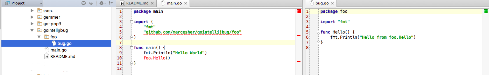

# Summary

in main.go, importing a subpackage is not recognized as a valid import, and consequently package navigation does not work
as expected



# Actual behavior

given main.go:

```
package main

import (
	"fmt"
	"github.com/marcesher/gointellijbug/foo"
)

func main() {
	fmt.Println("Hello World")
	foo.Hello()
}
```

1. The import of the `.../foo` package is underlined red
1. `foo.Hello()` is colored red and cmd+clicking does not result in navigating to that package's `Hello` function

# Expected behavior

1. The import of `.../foo` package would not be underlined and would be found, just like any other package
1. `foo.Hello()` would not be colored red and cmd+clicking it would navigate to that package function